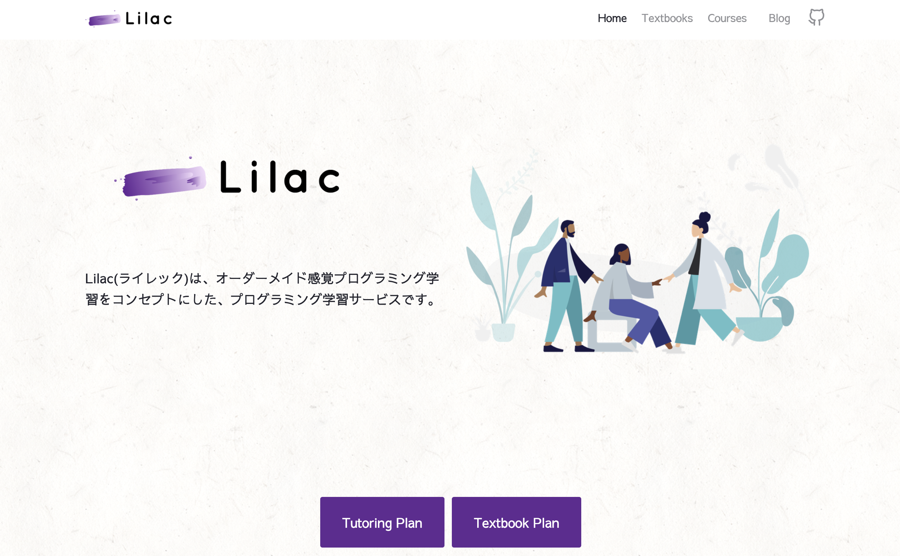

# lilac-docz-gatsby-web



Lilac is an online programming platform to provide 2 ways to learn programming.

1. Hands-on documentations only for advanced learners 📚
2. Hands-on documentations and one-on-one lessons with a teacher 👩‍🏫

## Dev environment

- Gatsby.js
- docz
- Netlify
- TypeScript
- Firebase Auth

# docz-website

Docz theme build for [docz site](http://docz.site)!

## Installation and usage

Just install the dependencies, then run Docz devserver to make changes!

```bash
yarn install
yarn dev
```

The website will be available at [http://localhost:3000](http://localhost:3000).

After you make your changes, please send me a pull request!

🤓